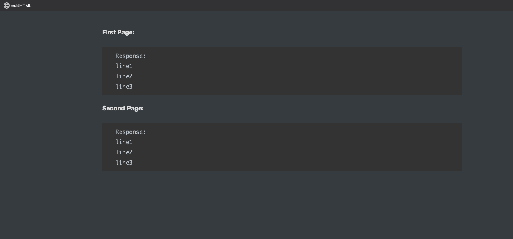
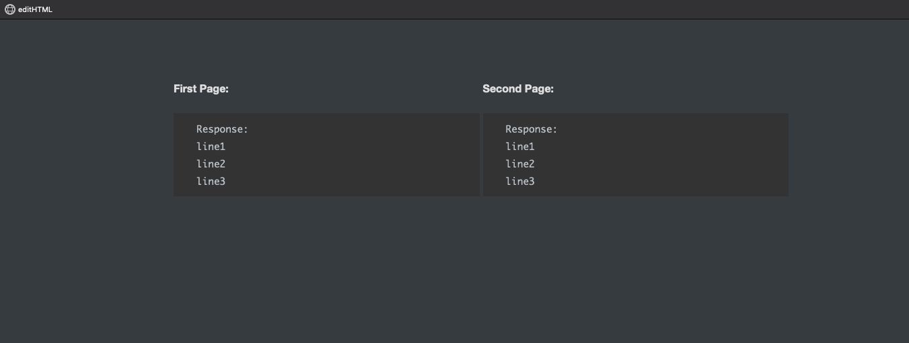

### editHTML
Script to edit typora generated HTML (Internal requirement)

We can make a bookmarklet with this code and can modify the HTML to predefined requiment with a single click.

The input format is as below 
 

The script can convert into the below format (side by side) 
 

Note: This only works when we write the heading in P tag and the code block in code fences (typora) 
